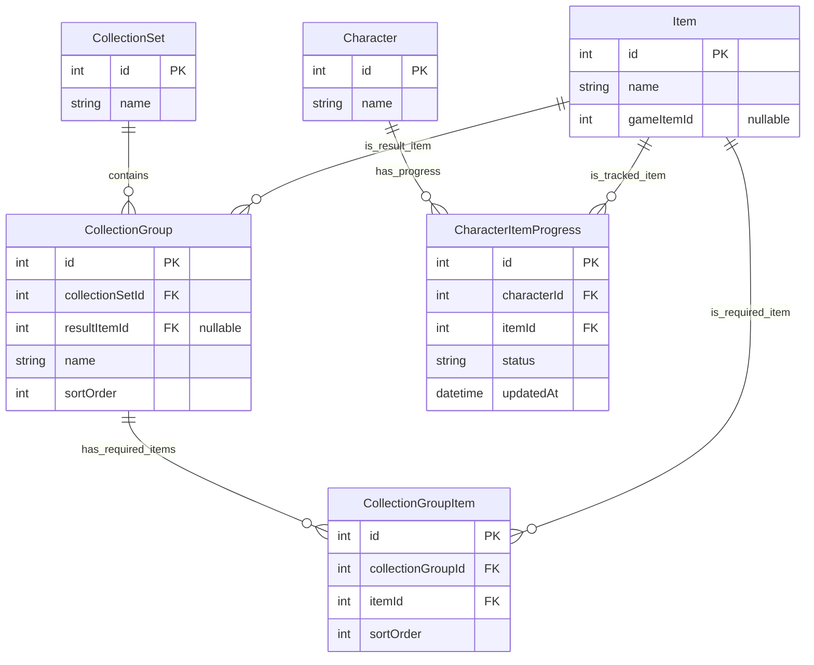
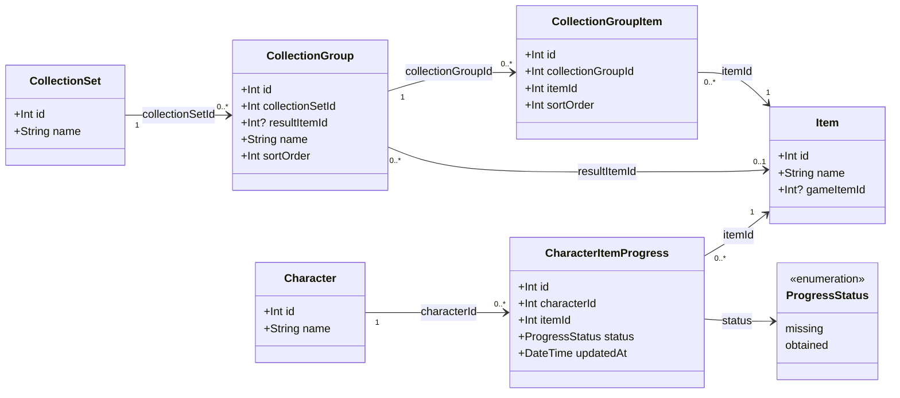

Initial schema, barebones for initial focused scope.  Character name is unique currently, will need to
be updated when users are added to instead be unique to each user.

```mermaid
erDiagram
  Character {
    int id PK
    string name
  }

  Item {
    int id PK
    string name
    int gameItemId "nullable"
  }

  CollectionSet {
    int id PK
    string name
  }

  CollectionGroup {
    int id PK
    int collectionSetId FK
    int resultItemId FK "nullable"
    string name
    int sortOrder
  }

  CollectionGroupItem {
    int id PK
    int collectionGroupId FK
    int itemId FK
    int sortOrder
  }

  CharacterItemProgress {
    int id PK
    int characterId FK
    int itemId FK
    string status
    datetime updatedAt
  }

  CollectionSet ||--o{ CollectionGroup : contains
  CollectionGroup ||--o{ CollectionGroupItem : has_required_items
  Item ||--o{ CollectionGroupItem : is_required_item

  Item ||--o{ CollectionGroup : is_result_item

  Character ||--o{ CharacterItemProgress : has_progress
  Item ||--o{ CharacterItemProgress : is_tracked_item
```

```mermaid
classDiagram
    direction LR

    class Character {
        +Int id
        +String name
    }

    class Item {
        +Int id
        +String name
        +Int? gameItemId
    }

    class CollectionSet {
        +Int id
        +String name
    }

    class CollectionGroup {
        +Int id
        +Int collectionSetId
        +Int? resultItemId
        +String name
        +Int sortOrder
    }

    class CollectionGroupItem {
        +Int id
        +Int collectionGroupId
        +Int itemId
        +Int sortOrder
    }

    class CharacterItemProgress {
        +Int id
        +Int characterId
        +Int itemId
        +ProgressStatus status
        +DateTime updatedAt
    }

    class ProgressStatus {
        <<enumeration>>
        missing
        obtained
    }

    CollectionSet "1" --> "0..*" CollectionGroup : collectionSetId
    CollectionGroup "1" --> "0..*" CollectionGroupItem : collectionGroupId
    CollectionGroupItem "0..*" --> "1" Item : itemId

    CollectionGroup "0..*" --> "0..1" Item : resultItemId

    Character "1" --> "0..*" CharacterItemProgress : characterId
    CharacterItemProgress "0..*" --> "1" Item : itemId
    CharacterItemProgress --> ProgressStatus : status
```
